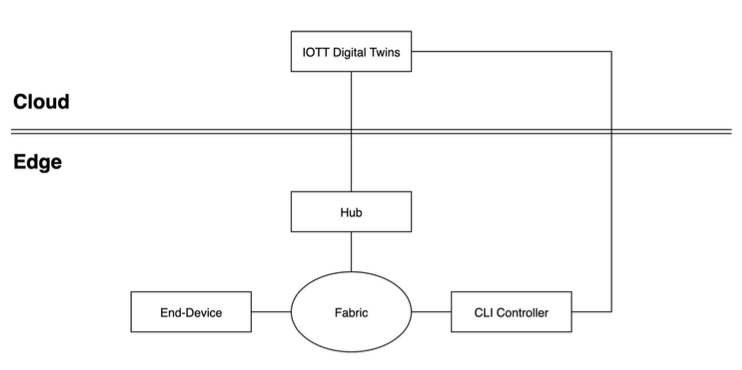

## Main Goal

- Develop a Proof of Concept for a lightweight matter hub which integrates with Bosch IoT Things (IOTT)

## Sub-goals
- Implement an ecosystem with the hub as an admin
- Nodes need to be able to identify and authenticate themself
- The hub should be able to communicate with the IOTT digital twin inside the cloud and with the End-Device
